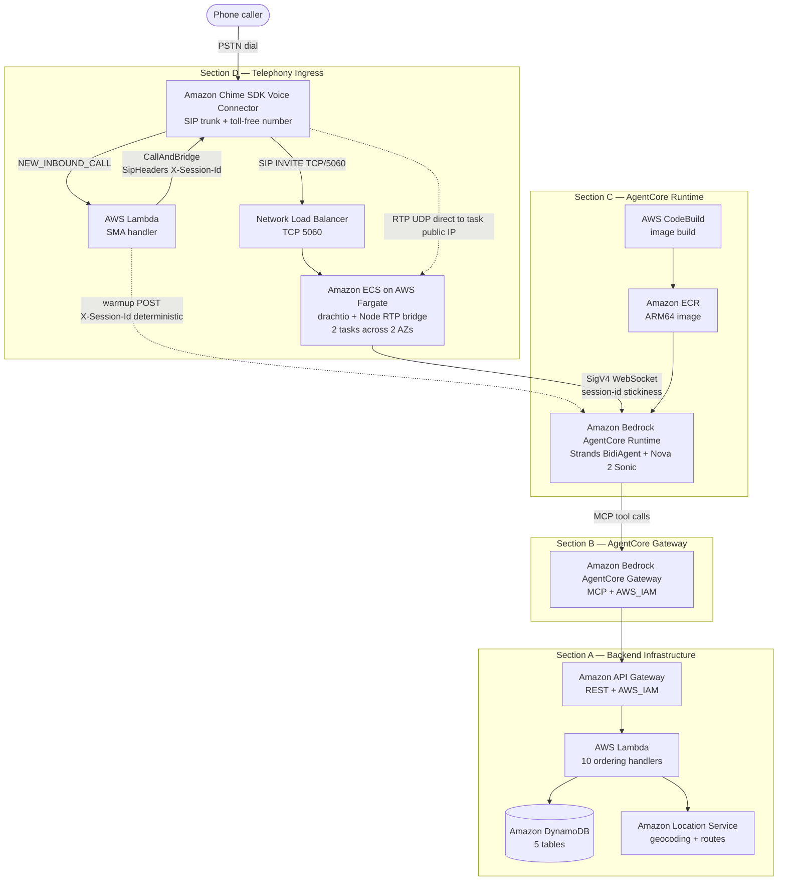

# Guidance for Telephony Voice Ordering on AWS

## Table of Contents

1. [Overview](#overview)
    - [User request flow](#user-request-flow)
    - [Cost](#cost)
    - [Sample Cost Table](#sample-cost-table)
2. [Prerequisites](#prerequisites)
    - [Operating System](#operating-system)
    - [Third-party tools](#third-party-tools)
    - [AWS account requirements](#aws-account-requirements)
    - [AWS CDK bootstrap](#aws-cdk-bootstrap)
    - [Supported Regions](#supported-regions)
3. [Automated Deployment](#automated-deployment)
4. [Manual Deployment](#manual-deployment)
5. [Deployment Validation](#deployment-validation)
6. [Running the Guidance](#running-the-guidance)
7. [Next Steps](#next-steps)
8. [Cleanup](#cleanup)
9. [Notices](#notices)
10. [FAQ, Known Issues, Additional Considerations, and Limitations](#faq-known-issues-additional-considerations-and-limitations)
11. [Revisions](#revisions)
12. [Authors](#authors)

## Overview

This Guidance demonstrates how to build a voice-driven telephony ordering system for quick-service restaurants (QSR). Customers dial a single United States E.164 phone number on any standard carrier and converse with an AI agent that takes the order end-to-end without screens, apps, or sign-in. The Guidance addresses the PSTN ordering channel by combining a Session Initiation Protocol (SIP) gateway, real-time speech-to-speech AI, and a decoupled scalable backend.

The Guidance uses **Amazon Chime SDK Voice Connector** for SIP trunking and Public Switched Telephone Network (PSTN) inbound, **Amazon Bedrock AgentCore Runtime** for agent hosting with microVM session isolation, **Amazon Nova 2 Sonic** for bidirectional speech-to-speech processing, the **Strands Agents** framework for conversational agent logic, **Amazon Location Service** for geocoding and route calculation, and **Model Context Protocol (MCP)** for standardized tool interactions between the agent and backend services. The SIP signaling and Real-time Transport Protocol (RTP) media plane runs on **Amazon Elastic Container Service (Amazon ECS) on AWS Fargate** behind an internet-facing **Network Load Balancer**. All infrastructure is deployed using **AWS Cloud Development Kit (AWS CDK)**.

The architecture implements a four-section decoupled pattern:



**Section A — Backend Infrastructure.** Four AWS CDK stacks deploy the restaurant backend: **Amazon DynamoDB** tables for customer profiles, orders, menu items, carts, and locations; **Amazon Location Service** for geocoding and route calculation; **AWS Lambda** functions for business logic; and **Amazon API Gateway** REST endpoints with **AWS Identity and Access Management (IAM)** authorization.

**Section B — AgentCore Gateway.** One AWS CDK stack creates the **Amazon Bedrock AgentCore Gateway** with MCP protocol, exposing eight backend API endpoints as discoverable MCP tools that the agent invokes by name.

**Section C — AgentCore Runtime.** Three AWS CDK stacks provision **Amazon Elastic Container Registry (Amazon ECR)** for container storage, **Amazon Simple Storage Service (Amazon S3)** for source uploads, **AWS CodeBuild** for ARM64 container builds, and the **Amazon Bedrock AgentCore Runtime** itself. The agent runs the Strands Agents framework with Amazon Nova 2 Sonic for bidirectional voice streaming over a SigV4-signed WebSocket.

**Section D — Telephony Ingress.** Four AWS CDK stacks provision the SIP and media path: **Amazon Chime SDK Voice Connector** with a toll-free Direct Inward Dialing (DID) number, an **AWS Lambda** SIP Media Application (SMA) event handler, a shared Amazon Virtual Private Cloud (Amazon VPC), and the SIP gateway itself: an internet-facing Network Load Balancer plus a two-task Amazon ECS on AWS Fargate service running drachtio-server and a Node.js Real-time Transport Protocol bridge. SIP signaling rides Transmission Control Protocol (TCP) port 5060 through the load balancer; media (RTP/UDP 16000–16048) flows direct from Amazon Chime SDK Voice Connector to each task's auto-assigned public Internet Protocol (IP) address, with the task security group locked to the published Amazon Chime SDK Voice Connector source CIDRs.

### User request flow

1. The caller dials the United States E.164 toll-free phone number provisioned by **Amazon Chime SDK Voice Connector**. The carrier delivers the call to the Amazon Chime SDK Voice Connector edge.
2. The Voice Connector triggers the **AWS Lambda** SIP Media Application handler with `NEW_INBOUND_CALL`. The handler derives a deterministic session identifier from the caller's phone number hashed with a server-side pepper from **AWS Systems Manager Parameter Store**, then issues a SigV4-signed `POST /invocations` warmup request to **Amazon Bedrock AgentCore Runtime** carrying that session identifier as the `X-Amzn-Bedrock-AgentCore-Runtime-Session-Id` header. AgentCore Runtime allocates a microVM, binds the session identifier to it, and routes the warmup request to the agent container, which runs the expensive per-call setup (system prompt resolution via the prompt-renderer Lambda, Amazon Nova 2 Sonic stream open, Model Context Protocol tool discovery, agent priming) inside the warmup window and stashes the result in a microVM-local cache keyed by the session identifier. The handler returns a `CallAndBridge` action pointing back at the Voice Connector with the session identifier propagated as a custom Session Initiation Protocol (SIP) header `X-Session-Id`.
3. The Voice Connector originates a SIP INVITE over Transmission Control Protocol port 5060 to the **Network Load Balancer** Domain Name System (DNS) name. The load balancer forwards the connection to one of the **Amazon ECS on AWS Fargate** tasks running drachtio-server. The bridged INVITE carries the `X-Session-Id` header forward unchanged.
4. The Fargate task answers with `200 OK`. The Session Description Protocol (SDP) `c=` line carries the task's own auto-assigned public IP address, so Real-time Transport Protocol media flows direct from Amazon Chime SDK Voice Connector to the task on User Datagram Protocol (UDP) ports 16000-16048 — the load balancer is not in the media path.
5. The task's Node.js bridge reads the `X-Session-Id` SIP header and opens a SigV4-signed WebSocket to **Amazon Bedrock AgentCore Runtime** pinned to the same session identifier. AgentCore Runtime routes the WebSocket to the warmed microVM (microVM stickiness), and the agent container attaches to the pre-built call context in milliseconds via the warm-cache lookup. Inbound caller audio (G.711 mu-law at 8 kHz) is decoded and resampled to 16 kHz Linear Pulse Code Modulation (PCM) and forwarded over the WebSocket; agent audio is paced back to the caller in 20-millisecond Real-time Transport Protocol frames.
6. The runtime drives the **Amazon Nova 2 Sonic** bidirectional session that was opened during warmup. The Strands Agents framework drives turn-taking, transcription, and tool use; a 20-second silence-frame keepalive on the agent side prevents the model's 55-second server-side idle timeout during long backend tool calls.
7. When the agent invokes a tool (`GetMenu`, `AddToCart`, `PlaceOrder`, `GetPreviousOrders`, and others), **Amazon Bedrock AgentCore Gateway** forwards the call as a REST request to **Amazon API Gateway**, which routes to **AWS Lambda** business handlers that read or write **Amazon DynamoDB** and call **Amazon Location Service** for geocoding. `GetPreviousOrders` enriches each order row with the location's address fields by issuing a `BatchGetCommand` against the Locations table so the agent can refer to a caller's previous pickup location by street name rather than an internal identifier.
8. When the call ends, the Fargate bridge issues a SigV4-signed `StopRuntimeSession` to AgentCore Runtime so the per-session microVM slot is released against the account-level Active session workloads quota.
9. **AWS CDK** deploys the entire solution with one shell script that uploads source to **Amazon S3**, triggers **AWS CodeBuild** to build the ARM64 container image stored in **Amazon ECR**, and provisions the eleven CloudFormation stacks in dependency order.
10. **Amazon CloudWatch** ingests structured logs and custom metrics from every component (`ActiveCalls` per Fargate task, per-call duration, error counters). All data at rest is encrypted using **AWS Key Management Service (AWS KMS)**.

### Cost

You are responsible for the cost of the AWS services used while running this Guidance. As of May 2026, the cost for running this Guidance with the default settings in the US East (N. Virginia) Region is approximately **$237 per month** for processing 1,000 voice orders averaging 5 minutes each, with two always-on Amazon ECS on AWS Fargate tasks providing high availability across two Availability Zones.

Create a [Budget](https://docs.aws.amazon.com/cost-management/latest/userguide/budgets-managing-costs.html) through [AWS Cost Explorer](https://aws.amazon.com/aws-cost-management/aws-cost-explorer/) to manage costs. Prices are subject to change. For full details, refer to the pricing page for each AWS service used in this Guidance.

### Sample Cost Table

The following table provides a sample cost breakdown for deploying this Guidance with the default parameters in the US East (N. Virginia) Region for one month. Estimates assume 1,000 calls per month at 5 minutes each and two always-on Amazon ECS on AWS Fargate tasks (one per Availability Zone), and do not account for AWS Free Tier benefits.

| AWS service | Dimensions | Cost [USD] |
| ----------- | ---------- | ---------- |
| [Amazon Chime SDK PSTN Audio (toll-free inbound)](https://aws.amazon.com/chime/chime-sdk/pricing/) | 5,000 inbound minutes at $0.012 per minute | $60.00 |
| [Amazon ECS on AWS Fargate (ARM64)](https://aws.amazon.com/fargate/pricing/) | 2 tasks, 1 vCPU + 2 GB memory each, 730 hours per month | $72.08 |
| [Amazon Bedrock (Nova 2 Sonic)](https://aws.amazon.com/bedrock/pricing/) | ~680 input + ~5,083 output speech tokens per session, ~7,438 input + ~1,260 output text tokens per session, 1,000 sessions | $68.96 |
| [Amazon Network Load Balancer](https://aws.amazon.com/elasticloadbalancing/pricing/) | 1 internet-facing load balancer, 730 hours, modest LCU usage | $21.43 |
| [Amazon Bedrock AgentCore Runtime](https://aws.amazon.com/bedrock/agentcore/pricing/) | 1,000 sessions, ~5 minutes each, ~30% active CPU, 1 vCPU, 2 GB memory | $5.20 |
| [Amazon Chime SDK Voice Connector](https://aws.amazon.com/chime/chime-sdk/pricing/) | 5,000 minutes at $0.00071 per minute, 1 toll-free phone number at $2.00 per month | $5.55 |
| [Amazon CloudWatch](https://aws.amazon.com/cloudwatch/pricing/) | ~5 GB log ingestion, 10 custom metrics, 5 alarms | $4.50 |
| [AWS Lambda](https://aws.amazon.com/lambda/pricing/) | ~30,000 invocations, 512 MB, ~1 second average duration | $0.30 |
| [Amazon API Gateway](https://aws.amazon.com/api-gateway/pricing/) | ~29,000 REST API calls | $0.10 |
| [Amazon Bedrock AgentCore Gateway](https://aws.amazon.com/bedrock/agentcore/pricing/) | 1,000 search calls plus 29,000 tool invocations, 8 tools indexed | $0.17 |
| [Amazon DynamoDB](https://aws.amazon.com/dynamodb/pricing/) | 5 tables, on-demand, ~30,000 reads plus ~5,000 writes | $0.05 |
| [Amazon Location Service](https://aws.amazon.com/location/pricing/) | ~1,000 geocoding calls plus ~500 route calculations | $0.50 |
| [Amazon ECR](https://aws.amazon.com/ecr/pricing/) | ~1 GB image storage above the free tier | $0.10 |
| [Amazon S3 (CodeBuild source)](https://aws.amazon.com/s3/pricing/) | <100 MB source asset storage | $0.05 |
| [AWS Systems Manager Parameter Store (advanced)](https://aws.amazon.com/systems-manager/pricing/) | 3 advanced parameters (customer-id pepper SecureString + loyalty prompt + anonymous prompt, both over 4 KB), 730 hours | $0.15 |
| | **Estimated Total** | **~$237** |

**Notes:**

- Toll-free per-minute charges and always-on Amazon ECS on AWS Fargate task hours are the dominant cost drivers (about 56 percent of the total).
- Switching from a toll-free to a local Direct Inward Dialing number reduces the inbound minute charge from $0.012 per minute to about $0.0011 per minute, lowering the monthly estimate by roughly $54.
- Right-sizing or scaling the Amazon ECS on AWS Fargate fleet to zero outside business hours is a viable cost optimization once traffic patterns are known.
- Amazon Nova 2 Sonic output speech tokens drive Amazon Bedrock cost; observed pricing is consistent with the public quick-service-restaurant ordering reference architecture.
- Costs scale roughly linearly with call volume above the always-on baseline.

## Prerequisites

### Operating System

These deployment instructions are tested on **macOS**, **Amazon Linux 2023**, and mainstream Linux distributions. Deployment on Windows is not tested; use Windows Subsystem for Linux 2 (WSL2) if needed.

### Third-party tools

Install the following four tools before deployment:

- [Node.js](https://nodejs.org/) version 24.x or later (required for AWS CDK, the Lambda bundler, and synthetic-data scripts; Node.js 25.x is also accepted).
- [AWS Command Line Interface (AWS CLI)](https://docs.aws.amazon.com/cli/latest/userguide/getting-started-install.html) version 2.x configured with credentials.
- [git](https://git-scm.com/) for cloning the repository.
- (Optional) [Docker](https://www.docker.com/) only if you want to run the SIP gateway container locally for debugging. **Docker is not required to deploy.**

The agent container is Python 3.13, but a developer with only the four tools above can deploy the full stack. There is no need to install `python`, `pip`, `poetry`, `uv`, `pyenv`, `conda`, `portaudio`, `libsrtp`, `libopus`, `ffmpeg`, or related toolchains on your workstation. All Python package resolution and container assembly runs inside AWS CodeBuild on ARM64 at deploy time.

### AWS account requirements

- AWS Identity and Access Management permissions to deploy AWS CDK stacks and AWS CloudFormation templates, and to create resources in: Amazon Chime SDK PSTN Audio, Amazon Bedrock AgentCore Runtime and Gateway, Amazon Bedrock (Nova 2 Sonic), AWS Lambda, Amazon DynamoDB, Amazon Location Service, Amazon API Gateway, Amazon ECR, AWS CodeBuild, Amazon S3, Amazon CloudWatch Logs and Metrics, AWS Systems Manager Parameter Store, Amazon ECS, AWS Fargate, Amazon VPC, and AWS Identity and Access Management.
- Amazon Bedrock model access for **Amazon Nova 2 Sonic** (`amazon.nova-2-sonic-v1:0`). Request access through the [Amazon Bedrock console](https://console.aws.amazon.com/bedrock/) model access page.
- Amazon Chime SDK PSTN Audio access. Phone-number ordering is governed by a separate AWS service quota; if you have never ordered an Amazon Chime SDK phone number in this account, request a quota increase through the [Amazon Chime SDK console](https://console.aws.amazon.com/chime-sdk/) before deployment.

### AWS CDK bootstrap

If you are using AWS CDK for the first time in this account or Region, bootstrap the environment:

```bash
npx cdk bootstrap aws://<ACCOUNT_ID>/<REGION>
```

Replace `<ACCOUNT_ID>` with your AWS account ID and `<REGION>` with your target Region (for example, `us-east-1`).

### Supported Regions

Deploy in a Region where all three of the following are available:

- Amazon Bedrock model access for Amazon Nova 2 Sonic (`amazon.nova-2-sonic-v1:0`).
- Amazon Chime SDK PSTN Audio.
- Amazon Bedrock AgentCore Runtime.

`us-east-1` (US East, N. Virginia) is the recommended starting Region. Check the [Amazon Bedrock pricing page](https://aws.amazon.com/bedrock/pricing/) for current Region availability.

Amazon Bedrock AgentCore Runtime supports a subset of Availability Zones per Region. In `us-east-1` as of May 2026, the supported Availability Zone IDs are `use1-az1`, `use1-az2`, and `use1-az4`. The Availability Zone ID to letter mapping is randomized per account, so the deploy script `scripts/deploy-all.sh` resolves the supported letters at deploy time and passes them to the network stack as AWS CDK context — no manual Availability Zone selection is required.

## Automated Deployment

For automated deployment, the script `scripts/deploy-all.sh` provisions every AWS CDK stack in dependency order, threads cross-stack identifiers via `cdk-outputs/*.json` files and `--parameters Stack:Key=Value` flags, and waits for AWS CodeBuild to finish building the agent container image.

**Usage:**

```bash
git clone <this-repo-url>
cd telephony-voice-ordering-agent

# 1. Preflight — verifies Node.js, npm, AWS CLI, git, AWS CDK bootstrap, and Amazon Bedrock model access.
./scripts/preflight-check.sh

# 2. Deploy with the default deployment prefix.
./scripts/deploy-all.sh --deploymentPrefix qsr-tel
```

**Optional parameters:**

- `--deploymentPrefix <name>` — Prefix applied to every physical resource name. Must match `^[a-z][a-z0-9-]{1,19}$` (1-20 lowercase characters, starting with a letter). Default: `qsr-tel`.
- `--mode update|fresh` — `update` (default) is an idempotent redeploy; `fresh` runs `cleanup-all.sh --force` before deploying.
- `--force-deploy` — Redeploy every layer even if `.deployment-state.json` marks it as already done.
- `--skip-preflight` — Skip the Node.js, npm, AWS CLI, and git preflight check.
- `--with-synthetic-data --user-name "Jane Doe" --user-phone "+12125550100" --location "Dallas, TX" --business-name "burgers"` — Seed Amazon DynamoDB with sample customer, locations, menu items, and orders for end-to-end testing.

**What the script does:**

- Verifies all prerequisites (Node.js, npm, AWS CLI, git, AWS CDK bootstrap, Amazon Bedrock model access).
- Deploys the backend infrastructure (Amazon DynamoDB tables, Amazon Location Service resources, AWS Lambda functions, Amazon API Gateway).
- Deploys Amazon Bedrock AgentCore Gateway (MCP server exposing backend APIs as discoverable tools).
- Builds the ARM64 container image in AWS CodeBuild and pushes it to Amazon ECR.
- Deploys Amazon Bedrock AgentCore Runtime with the built image.
- Deploys the SIP gateway (Amazon ECS on AWS Fargate behind a Network Load Balancer).
- Provisions the Amazon Chime SDK Voice Connector, toll-free phone number, SIP rule, and SIP Media Application Lambda.
- Optionally seeds synthetic data into Amazon DynamoDB for an end-to-end test.

On success, the final line of standard output is the single externally visible artifact:

```
Your telephony agent is live at +1XXXXXXXXXX — dial to test.
```

A second deployment into the same AWS account requires cloning the repository into a fresh folder and passing a different `--deploymentPrefix`. The deployment-state file enforces a first-prefix-wins lock per working copy.

**Note:** For a detailed understanding of each deployment step, see the [Manual Deployment](#manual-deployment) section.

## Manual Deployment

Each module is an independent AWS CDK app. Deploy in the eleven-step order below; later modules consume outputs from earlier ones.

| # | Module | AWS CDK directory | Stack |
|---|---|---|---|
| 1 | DynamoDB tables | `backend/backend-infrastructure/` | `DynamoDBStack` |
| 2 | Amazon Location Service | `backend/backend-infrastructure/` | `LocationStack` |
| 3 | Ordering AWS Lambda functions | `backend/backend-infrastructure/` | `LambdaStack` |
| 4 | Amazon API Gateway | `backend/backend-infrastructure/` | `ApiGatewayStack` |
| 5 | Amazon Bedrock AgentCore Gateway | `backend/agentcore-gateway/cdk/` | `AgentCoreGatewayStack` |
| 6 | Shared Amazon VPC | `backend/network/` | `NetworkStack` |
| 7 | Agent Amazon ECR | `backend/agentcore-runtime-telephony/cdk/ecr/` | `AgentEcrStack` |
| 8 | Agent AWS CodeBuild | `backend/agentcore-runtime-telephony/cdk/build/` | `AgentBuildStack` |
| 9 | Amazon Bedrock AgentCore Runtime | `backend/agentcore-runtime-telephony/cdk/runtime/` | `AgentRuntimeStack` |
| 10 | SIP gateway (Amazon ECS on AWS Fargate + Network Load Balancer) | `telephony-interface/telephony-sip-gateway/cdk/` | `SipGatewayStack` |
| 11 | Telephony ingress (Amazon Chime SDK Voice Connector + phone number + SMA Lambda) | `telephony-interface/telephony-ingress/cdk/` | `IngressStack` |

Each AWS CDK invocation must thread `--parameters <StackId>:DeploymentPrefix=<prefix>` plus any upstream identifiers from `cdk-outputs/*.json`. The `json_val` helper in `scripts/deploy-all.sh` documents the exact parameter names per layer; reading the script is the most direct way to derive a manual single-layer recipe. Each module also carries its own `README.md` with the per-stack `CfnParameter` and `CfnOutput` catalog.

## Deployment Validation

After `scripts/deploy-all.sh` completes, verify that every CloudFormation stack is live:

```bash
aws cloudformation list-stacks \
  --stack-status-filter CREATE_COMPLETE UPDATE_COMPLETE \
  --query "StackSummaries[?StackName=='DynamoDBStack' \
    || StackName=='LocationStack' \
    || StackName=='LambdaStack' \
    || StackName=='ApiGatewayStack' \
    || StackName=='AgentCoreGatewayStack' \
    || StackName=='NetworkStack' \
    || StackName=='AgentEcrStack' \
    || StackName=='AgentBuildStack' \
    || StackName=='AgentRuntimeStack' \
    || StackName=='SipGatewayStack' \
    || StackName=='IngressStack'].StackName"
```

All eleven stacks are expected. Confirm the Amazon ECS service is healthy:

```bash
aws ecs describe-services --region us-east-1 \
  --cluster <prefix>-sip-gateway \
  --services <prefix>-sip-gateway \
  --query 'services[0].{desired:desiredCount,running:runningCount,rolloutState:deployments[0].rolloutState}'
```

Expected output: `desired = 2`, `running = 2`, `rolloutState = COMPLETED`.

Order provenance is persisted in the `<prefix>-Orders` Amazon DynamoDB table with `channel = "telephony"`, a non-empty `fromPhoneNumber` (or `""` for anonymous callers), and an `anonymousCaller` boolean. After dialing the test number and placing a sample order, scan the table:

```bash
aws dynamodb scan --table-name <prefix>-Orders \
  --filter-expression "#c = :ch" \
  --expression-attribute-names '{"#c":"channel"}' \
  --expression-attribute-values '{":ch":{"S":"telephony"}}' \
  --max-items 5
```

## Running the Guidance

There is no web user interface, no test client, and no browser step. Dial the United States E.164 phone number printed at the end of `scripts/deploy-all.sh` from a standard United States telephone capable of reaching toll-free numbers. The Amazon Chime SDK Voice Connector answers, the Amazon ECS on AWS Fargate task accepts the SIP INVITE and starts a Real-time Transport Protocol media stream direct to the task, and the SigV4-signed WebSocket to Amazon Bedrock AgentCore Runtime carries audio in both directions.

### Inputs

- A working United States telephone capable of dialing toll-free numbers.
- (Optional) A test caller phone number provisioned in Amazon DynamoDB through `scripts/deploy-all.sh --with-synthetic-data` so the agent recognizes a returning customer.

### Example conversation

```
Caller: (dials +1XXXXXXXXXX)

Agent:  Hi, thanks for calling. What can I get for you today?

Caller: I would like a chicken sandwich combo.

Agent:  Sure. Which ZIP code or cross-street should I use for pickup?

Caller: 75495.

Agent:  [Calling tools: GeocodeAddress, GetNearestLocations, GetMenu,
         AddToCart, PlaceOrder]

        Got it — one chicken sandwich combo for pickup at the Van
        Alstyne location, total $7.79, ready in about 15 minutes.
        Anything else?

Caller: No, that is it. Thank you.

Agent:  You are welcome — order confirmed. Have a great day.
```

### Expected output

- **Voice transcription.** The caller's speech is transcribed by Amazon Nova 2 Sonic and visible in the Amazon CloudWatch Logs stream for the runtime.
- **Agent response.** A natural voice response with order details streams back to the caller in real time over the WebSocket and the Real-time Transport Protocol media stream.
- **Tool invocations.** Backend tools (`GetMenu`, `AddToCart`, `GetCustomerProfile`, `GeocodeAddress`, `PlaceOrder`, and others) are called asynchronously through Amazon Bedrock AgentCore Gateway.
- **Order confirmation.** Order ID, total, and estimated ready time are spoken back to the caller and persisted in Amazon DynamoDB.

### Debugging and logging

- **SIP gateway logs.** Amazon CloudWatch Logs at `/ecs/<prefix>-sip-gateway` capture every SIP transaction (INVITE, 200 OK, ACK, BYE) and Real-time Transport Protocol bridge events from drachtio-server and the Node.js bridge.
- **Agent logs.** Amazon CloudWatch Logs at `/aws/bedrock-agentcore/runtimes/<runtime-name>` show the Strands Agents framework events, Amazon Nova 2 Sonic turn-taking, and tool-call details.
- **Lambda logs.** Amazon CloudWatch Logs at `/aws/lambda/<function-name>` for every ordering function and the SIP Media Application handler.
- **Amazon API Gateway logs.** Amazon CloudWatch Logs for the REST endpoint, with full request and response visibility on each tool call.
- **Custom metrics.** Active call counts per task and per service are published to the `<prefix>/SipGateway` Amazon CloudWatch namespace and drive autoscaling.

## Next Steps

Consider the following enhancements after deploying this Guidance:

- **Verified customer identification.** Layer one-time-password verification on top of the pseudonymous phone-hash and add a `phoneNumber` Global Secondary Index on `<prefix>-Customers`.
- **Inbound interactive voice response options** through Amazon Chime SDK `SpeakAndGetDigits`.
- **Outbound callbacks** ("your order is ready") through `CreateSipMediaApplicationCall`.
- **Multi-language support.** Amazon Nova 2 Sonic supports additional languages; extend the system prompt and menu data and configure voice selection per detected language.
- **Long-term call recording.** Configure Amazon S3 lifecycle and Amazon Chime SDK Voice Connector streaming for compliance or quality-assurance retention.
- **Call detail records.** Add an `<prefix>-CallDetailRecords` Amazon DynamoDB table and write one row per call on hangup for operational reporting.
- **Cross-region failover.** Deploy a second Region and use Amazon Route 53 latency-based routing with health checks for geographic redundancy.
- **End-of-call summarization.** Pipe transcripts to a customer relationship management or point-of-sale system for follow-up.

## Cleanup

Remove all deployed resources to stop incurring charges. The cleanup script destroys resources in reverse deployment order so that consumer stacks are removed before the producer stacks they depend on.

> **Warning:** Cleanup is destructive. Order history in Amazon DynamoDB, the toll-free phone number, the customer-id pepper in AWS Systems Manager Parameter Store, and any container images in Amazon ECR are deleted along with the stacks. Back up any data you want to keep before running cleanup.

### Automated cleanup

Preview what will be deleted, then run the cleanup:

```bash
# Preview deletions — no resources are removed.
./scripts/cleanup-all.sh --dry-run

# Delete every stack provisioned by deploy-all.sh.
./scripts/cleanup-all.sh
```

The script destroys resources in this order:

1. `IngressStack` — releases the Amazon Chime SDK toll-free phone number, deletes the SIP rule and SIP Media Application, removes the SMA Lambda.
2. `SipGatewayStack` — drains and deletes the Amazon ECS on AWS Fargate service, deletes the Network Load Balancer, removes the Amazon ECR repository.
3. `AgentRuntimeStack` — removes the Amazon Bedrock AgentCore Runtime and the customer-id pepper SecureString.
4. `AgentBuildStack` — deletes the AWS CodeBuild project and source Amazon S3 bucket.
5. `AgentEcrStack` — deletes the Amazon ECR repository for the agent container.
6. `NetworkStack` — deletes the Amazon Virtual Private Cloud, subnets, and Network Address Translation gateways.
7. `AgentCoreGatewayStack` — deletes the Amazon Bedrock AgentCore Gateway and the gateway service role.
8. `ApiGatewayStack` — deletes the REST API and execution role.
9. `LambdaStack` — deletes the ten ordering AWS Lambda functions.
10. `LocationStack` — deletes the Amazon Location Service place-index and route-calculator.
11. `DynamoDBStack` — deletes the five Amazon DynamoDB tables.

### Cleanup flags

| Flag | Purpose |
|---|---|
| `--force` | Skip confirmation prompts and pass `--force` to `cdk destroy`. |
| `--dry-run` | Show what would be deleted without deleting anything. |
| `--ignore-missing-resources` | Continue past stacks that have already been deleted. |
| `--skip-<component>` | Skip an individual layer (for example, `--skip-ingress` to keep the toll-free phone number). |

### Verify cleanup

Open the [AWS CloudFormation console](https://console.aws.amazon.com/cloudformation/) and confirm that all eleven stacks have been deleted. Confirm in the [Amazon Chime SDK console](https://console.aws.amazon.com/chime-sdk/) that the toll-free phone number has been released back to the pool. Confirm in the [Amazon ECR console](https://console.aws.amazon.com/ecr/) that the agent and SIP gateway repositories have been deleted.

## Notices

*Customers are responsible for making their own independent assessment of the information in this Guidance. This Guidance: (a) is for informational purposes only, (b) represents AWS current product offerings and practices, which are subject to change without notice, and (c) does not create any commitments or assurances from AWS and its affiliates, suppliers or licensors. AWS products or services are provided "as is" without warranties, representations, or conditions of any kind, whether express or implied. AWS responsibilities and liabilities to its customers are controlled by AWS agreements, and this Guidance is not part of, nor does it modify, any agreement between AWS and its customers.*

## FAQ, Known Issues, Additional Considerations, and Limitations

### Known issues

- **Amazon Chime SDK PSTN phone-number quota.** Phone-number ordering is gated by a separate AWS service quota. If you have never ordered an Amazon Chime SDK phone number in this account, the ingress stack fails with a quota error. Request a quota increase through the Amazon Chime SDK console before re-running the deploy.
- **AWS CodeBuild cold start.** The first deploy of the agent build stack assembles the ARM64 image from scratch (Python package resolution plus Docker layers); allow 8 to 12 minutes for the build waiter to finish.
- **Amazon Bedrock AgentCore Runtime cold start.** The first `InvokeAgentRuntime` call in a fresh deployment warms a microVM; subsequent calls reuse it. Plan for one warm-up dial after every deploy.
- **AWS Lambda runtime warnings.** During `cdk synth` and `cdk deploy`, `aws-cdk-lib` emits warnings about deprecated `NODEJS_18_X` runtimes for framework-internal custom resource handlers (`BucketDeployment`, `Vpc.restrictDefaultSecurityGroup`, and others). The `useLatestRuntimeVersion` feature flag does not cover these. Tracked upstream in [aws/aws-cdk#33626](https://github.com/aws/aws-cdk/issues/33626). The warnings are advisory; deployments succeed, and every Lambda owned by this Guidance pins `lambda.Runtime.NODEJS_24_X` explicitly.

### Additional considerations

- **Amazon Bedrock pricing.** Amazon Nova 2 Sonic charges per token (input and output). Output speech tokens are the dominant model-side cost driver. Monitor usage with Amazon CloudWatch and AWS Cost Explorer.
- **Amazon Chime SDK PSTN per-minute charges.** Toll-free inbound minutes are the dominant telephony-side cost. Switching to a local Direct Inward Dialing number reduces this cost by roughly an order of magnitude.
- **Network egress and Network Address Translation.** The agent reaches Amazon Bedrock, Amazon Chime SDK Voice Connector, Amazon S3, Amazon ECR, and Amazon CloudWatch through Network Address Translation gateways. Amazon VPC interface endpoints for Amazon S3, Amazon ECR, AWS Systems Manager, and AWS CloudWatch Logs are a valid cost optimization for steady-state traffic; they are not enabled by default.
- **Data retention.** Per-call session state lives only in memory on the Amazon ECS on AWS Fargate task and in Amazon Bedrock AgentCore Runtime. Long-term call recording and call detail records are out of scope for this Guidance. Configure Amazon DynamoDB time-to-live on `<prefix>-Carts` for automatic cleanup of stale carts.
- **Compliance.** Confirm that voice data handling complies with applicable regulations (such as General Data Protection Regulation, California Consumer Privacy Act, or sector-specific telephony rules) before deploying to production.
- **Identity and Access Management.** This Guidance creates AWS Identity and Access Management roles with scoped permissions and applies `cdk-nag` at synth time. Review the policies in each AWS CDK stack to confirm they meet your organization's security requirements.
- **Rate limiting.** Implement Amazon API Gateway throttling and consider AWS Shield Advanced on the Network Load Balancer Elastic IP addresses for production deployments.

### Limitations

- **Telephony only.** The Guidance has no web user interface, mobile application, or browser client.
- **English only.** The system prompt and menu are configured for English. Amazon Nova 2 Sonic supports additional languages that can be enabled by modifying the system prompt and adding a voice for each.
- **No device GPS.** The agent asks the caller for a ZIP code or cross-street and uses Amazon Location Service for geocoding.
- **One call, one Amazon Bedrock AgentCore Runtime session.** Each call runs to completion in its own session; there is no cross-call state on the runtime.
- **Single Region.** The Guidance deploys into one AWS Region. Cross-Region failover is documented under Next Steps and is not provided out of the box.

For feedback, questions, or suggestions, open an issue in the repository.

## Revisions

- **v3.1.0 (May 2026)** — Cold-start mitigation, prompt-rendering pipeline, and operator ergonomics. The Session Initiation Protocol Media Application Lambda issues a SigV4-signed warmup `POST /invocations` to Amazon Bedrock AgentCore Runtime with a deterministic session identifier derived from the caller's phone number, allowing the agent container to do the per-call setup work (system prompt resolution, Amazon Nova 2 Sonic stream open, Model Context Protocol tool discovery) inside the ringing window before the bridged Session Initiation Protocol INVITE arrives. The Session Initiation Protocol gateway reuses the same session identifier on its WebSocket connection so the call attaches to the pre-warmed microVM. Brand identity is now a deploy-time variable: the `--synth-business-name` flag threads through AWS Cloud Development Kit context and substitutes a `{BUSINESS_NAME}` placeholder in both system prompts at synth time. The `GetPreviousOrders` Lambda now enriches each order row with location address fields via `BatchGetCommand` so the agent can reference previous pickup locations by street name rather than an internal identifier. Both system prompts moved to AWS Systems Manager Parameter Store Advanced tier to fit a strengthened "no internal identifiers" guard and per-tool filler-phrase guidance. The deploy script auto-recovers the deployment prefix from the local state file when the operator omits the flag.
- **v3.0.0 (May 2026)** — Architecture pivot to Real-time Transport Protocol direct from Amazon Chime SDK Voice Connector to the Amazon ECS on AWS Fargate task's auto-assigned public IP address. The Network Load Balancer carries Session Initiation Protocol on Transmission Control Protocol port 5060 only; media bypasses the load balancer entirely. Two-IP-split between the SIP Contact header (Network Load Balancer Elastic IP) and the SDP `c=` line (task public IP). Twenty-second silence-frame keepalive on the agent side prevents the Amazon Nova 2 Sonic fifty-five-second server-side idle timeout.
- **v2.0.0 (May 2026)** — drachtio-server SIP gateway on Amazon ECS on AWS Fargate replaces the previous Amazon Kinesis Video Streams plus Amazon Chime SDK PlayAudio architecture. SigV4-signed WebSocket between the SIP gateway and Amazon Bedrock AgentCore Runtime carries audio in both directions. Eleven AWS CDK stacks, all owned by this project, with no external reference-project dependency.
- **v1.0.0 (April 2026)** — Initial release. Amazon Bedrock AgentCore Runtime with `protocolConfiguration = HTTP` and `networkMode = VPC`. Single ARM64 container per call read Amazon Kinesis Video Streams and wrote Amazon Chime SDK `PlayAudio` directly. Five AWS CDK stacks: `NetworkStack`, `AgentEcrStack`, `AgentBuildStack`, `AgentRuntimeStack`, `IngressStack`. Python 3.13 agent and Node.js 24.x Lambdas.

## Authors

- Sergio Barraza, Senior TAM
- Salman Ahmed, Senior TAM
- Ravi Kumar, Senior TAM
