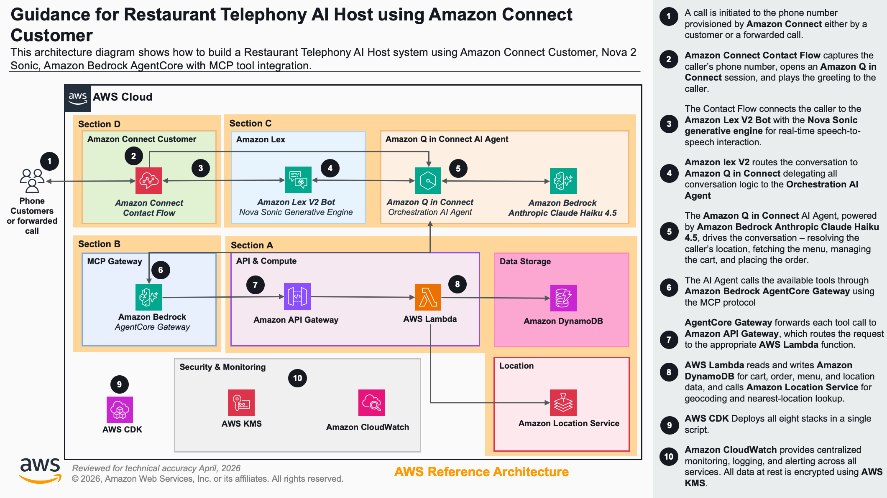

# Guidance for Telephony Voice Ordering on AWS with Amazon Connect Customer

## Table of Contents

1. [Overview](#overview)
2. [Architecture](#architecture)
3. [How It Works](#how-it-works)
    - [Contact Flow](#contact-flow)
    - [AI Agent Conversation](#ai-agent-conversation)
    - [Tool Execution](#tool-execution)
4. [Cost](#cost)
5. [Prerequisites](#prerequisites)
6. [Automated Deployment](#automated-deployment)
7. [Manual Deployment](#manual-deployment)
8. [Deployment Validation](#deployment-validation)
9. [Running the Guidance](#running-the-guidance)
10. [Cleanup](#cleanup)
11. [Notices](#notices)
12. [FAQ and Known Issues](#faq-and-known-issues)
13. [Authors](#authors)

---

## Overview

This guidance demonstrates how to build a fully voice-driven ordering system for quick-service restaurants (QSR) using **Amazon Connect** as the telephony layer and **Amazon Q in Connect** as the AI orchestration layer. A caller dials a standard phone number, speaks naturally, and the AI agent takes the order end-to-end - no apps, no screens, no sign-in required.

**Key services used:**

| Service | Role |
|---|---|
| **Amazon Connect** | Inbound telephony, contact flow, phone number |
| **Amazon Lex V2** | Speech-to-speech interface using the Nova Sonic generative engine |
| **Amazon Q in Connect** | ORCHESTRATION AI Agent (Claude Haiku 4.5) - reasoning, tool calls, conversation |
| **Amazon Bedrock AgentCore Gateway** | MCP server exposing backend REST APIs as discoverable tools |
| **Amazon AppIntegrations** | Registers the AgentCore Gateway as an MCP application |
| **Amazon API Gateway** | REST API (`prod` stage, AWS_IAM authorization) |
| **AWS Lambda** | Ten Node.js 24.x ordering functions |
| **Amazon DynamoDB** | Five tables: Customers, Orders, Menu, Carts, Locations |
| **Amazon Location Service** | Geocoding (place index) and route calculation |
| **AWS CDK** | All infrastructure as code, eight CloudFormation stacks |

The entire solution deploys in one command and tears down completely in one command.

---

## Architecture



The solution is organized into four sections:

**Section A - Backend Infrastructure**
Four stacks deploy the ordering backend: DynamoDB tables, Location Service resources, Lambda functions, and an API Gateway REST API with AWS_IAM authorization.

**Section B - AgentCore Gateway**
One stack provisions an Amazon Bedrock AgentCore Gateway with CUSTOM_JWT authorization. The gateway reads the OpenAPI schema from the REST API at deploy time, registers each endpoint as a named MCP tool, and validates inbound JWTs against the Connect instance's JWKS discovery endpoint.

**Section C - Connect Instance and AI Agent**
Two stacks create the Amazon Connect instance (with Contact Lens and bot management enabled), the Amazon Q in Connect assistant, and the ORCHESTRATION AI Agent. The agent stack registers the AgentCore Gateway as an MCP server in Amazon AppIntegrations, creates an Amazon Lex V2 bot with the Nova Sonic generative engine, defines the ORCHESTRATION AI Agent with the Claude Haiku 4.5 system prompt, publishes the agent version, and associates a security profile that grants the agent access to all ten MCP tools.

**Section D - Connect Telephony**
One stack creates the contact flow and claims the phone number. The contact flow is the entry point for every inbound call - it enables logging, captures the caller's phone number (ANI) as a contact attribute, opens a Q in Connect session tied to the assistant, stores the session ARN, plays the greeting to the caller, and hands the call to the Amazon Lex V2 bot. When the AI agent finishes and fires `Complete` or `Escalate`, the Lex bot returns control to the contact flow which reads the result from the Lex session attributes and disconnects the call. The phone number is claimed and associated to the contact flow as part of the same stack deployment.

---

## How It Works

### Contact Flow

When a call arrives, the contact flow executes six blocks in sequence:

1. **UpdateFlowLoggingBehavior** - enables Contact Lens flow logging to CloudWatch.
2. **UpdateContactAttributes** - copies `$.CustomerEndpoint.Address` (the caller's ANI) into the contact attribute `callerPhoneNumber`.
3. **CreateWisdomSession** - opens a Q in Connect session tied to the assistant ARN. This step is mandatory - without it, Amazon Lex V2 returns "Lex needs active session for Q In Connect".
4. **UpdateContactData** - stores the Q in Connect session ARN in the contact for downstream use.
5. **ConnectParticipantWithLexBot** - plays the greeting *"Thank you for calling, give me a moment to connect."* and hands the call to the Amazon Lex V2 bot alias.
6. **Compare (CheckTool)** - reads `$.Lex.SessionAttributes.Tool` after the bot returns. Routes to `DisconnectParticipant` on `Complete` or `Escalate`.

### AI Agent Conversation

The Amazon Q in Connect ORCHESTRATION AI Agent (Claude Haiku 4.5 - model ID `us.anthropic.claude-haiku-4-5-20251001-v1:0`) drives all conversation turns. The system prompt is configured for voice - responses are kept concise, prices are spoken naturally ("five ninety-nine"), and internal system identifiers are never exposed to the caller. The prompt instructs it to:

**Ordering workflow:**
1. Greet the caller: *"Hello, welcome to {CompanyName}! What can I get started for you today?"*
2. If the caller asks about items or prices and no `locationId` is known: ask for their city or zip code, call `GeocodeAddress`, then `GetNearestLocations` to resolve a `locationId`. Never call `GetMenu` without a `locationId`.
3. Call `GetMenu` with the `locationId`.
4. Call `AddToCart` for each requested item.
5. Call `GetCart`, read back all items and the total, and ask for confirmation.
6. On confirmation, call `PlaceOrder` to place the order.
7. Fire the `Complete` RETURN_TO_CONTROL tool when finished, or `Escalate` if the caller requests a human. For this demo, both paths disconnect the call. In production, wire the `Escalate` path in the contact flow to a Connect queue to transfer the caller to a live agent along with the full conversation context.

### Tool Execution

When the agent calls a tool, the request flows:

**Amazon Q in Connect** → **Amazon Bedrock AgentCore Gateway** (MCP, CUSTOM_JWT auth) → **Amazon API Gateway** (REST, AWS_IAM, `prod` stage) → **AWS Lambda** → **Amazon DynamoDB / Amazon Location Service**

The ten available MCP tools (all `MODEL_CONTEXT_PROTOCOL` type):

| Tool | HTTP method + path | Lambda |
|---|---|---|
| `GetMenu` | `GET /menu?locationId=` | `{prefix}-GetMenu` |
| `AddToCart` | `POST /cart` | `{prefix}-AddToCart` |
| `GetCart` | `GET /cart?customerId=` | `{prefix}-GetCart` |
| `UpdateCart` | `PUT /cart` | `{prefix}-UpdateCart` |
| `PlaceOrder` | `POST /order` | `{prefix}-PlaceOrder` |
| `GetNearestLocations` | `GET /locations/nearest?latitude=&longitude=` | `{prefix}-GetNearestLocations` |
| `GeocodeAddress` | `GET /locations/geocode?address=` | `{prefix}-GeocodeAddress` |
| `FindLocationAlongRoute` | `GET /locations/route?startLatitude=&startLongitude=&endLatitude=&endLongitude=` | `{prefix}-FindLocationAlongRoute` |
| `GetCustomerProfile` | `GET /customers/profile?customerId=` | `{prefix}-GetCustomerProfile` |
| `GetPreviousOrders` | `GET /customers/orders?customerId=` | `{prefix}-GetPreviousOrders` |

Plus two `RETURN_TO_CONTROL` tools: `Complete` and `Escalate`.

**Cart and order isolation:** Each caller has their own isolated cart. Concurrent calls cannot interfere with each other. The cart is automatically cleared after a successful order is placed.

---

## Cost

You are responsible for the cost of the AWS services used while running this guidance. As of July 2026, the estimated cost for processing 1,000 voice orders averaging 5 minutes each in the US East (N. Virginia) Region is approximately **$35 per month**.

Create a [Budget](https://docs.aws.amazon.com/cost-management/latest/userguide/budgets-managing-costs.html) through [AWS Cost Explorer](https://aws.amazon.com/aws-cost-management/aws-cost-explorer/) to help manage costs. Prices are subject to change.

| AWS service | Dimensions | Cost [USD] |
|---|---|---|
| [Amazon Connect - inbound DID minutes](https://aws.amazon.com/connect/pricing/) | 5,000 inbound minutes at $0.0018/min | $9.00 |
| [Amazon Bedrock - Nova Sonic (via Lex)](https://aws.amazon.com/bedrock/pricing/) | ~5,763 speech tokens/session × 1,000 sessions | $12.50 |
| [Amazon Bedrock - Claude Haiku 4.5 (orchestration)](https://aws.amazon.com/bedrock/pricing/) | ~8,698 text tokens/session × 1,000 sessions | $7.50 |
| [Amazon Lex V2](https://aws.amazon.com/lex/pricing/) | 5,000 speech requests | $2.50 |
| [Amazon Connect - phone number](https://aws.amazon.com/connect/pricing/) | 1 DID phone number | $1.00 |
| [Amazon Bedrock AgentCore Gateway](https://aws.amazon.com/bedrock/agentcore/pricing/) | ~10,000 tool invocations | $0.10 |
| [Amazon CloudWatch](https://aws.amazon.com/cloudwatch/pricing/) | ~3 GB log ingestion | $1.50 |
| [AWS Lambda](https://aws.amazon.com/lambda/pricing/) | ~30,000 invocations, 256 MB, ~0.5 s avg | $0.20 |
| [Amazon API Gateway](https://aws.amazon.com/api-gateway/pricing/) | ~10,000 REST API calls | $0.04 |
| [Amazon DynamoDB](https://aws.amazon.com/dynamodb/pricing/) | 5 tables, on-demand, ~35,000 ops | $0.05 |
| [Amazon Location Service](https://aws.amazon.com/location/pricing/) | ~1,000 geocode + ~500 place searches | $0.50 |
| | **Estimated Total** | **~$35** |

Notes:
- Switching from DID to toll-free increases the inbound per-minute rate from $0.0018 to $0.012.
- The Connect instance itself has no hourly charge - you pay for usage only.
- Costs scale roughly linearly with call volume.

---

## Prerequisites

### Operating System

Tested on **macOS**, **Amazon Linux 2023**, and mainstream Linux distributions. Windows is not tested; use WSL2 if needed.

### Third-party tools

- [Node.js](https://nodejs.org/) version 18.x or later (24.x recommended). Required for AWS CDK, the `esbuild` Lambda bundler, and synthetic-data scripts.
- [AWS CLI](https://docs.aws.amazon.com/cli/latest/userguide/getting-started-install.html) version 2.x, configured with credentials.
- [git](https://git-scm.com/) for cloning the repository.

No Docker, Python, or additional runtimes are required.

### AWS account requirements

- IAM permissions to create resources in: Amazon Connect, Amazon Lex V2, Amazon Q in Connect, Amazon Bedrock AgentCore Gateway, AWS Lambda, Amazon DynamoDB, Amazon Location Service, Amazon API Gateway, Amazon CloudWatch Logs, Amazon AppIntegrations, and AWS IAM.

- **Amazon Bedrock model access - Amazon Nova Sonic** (`amazon.nova-2-sonic-v1:0`). Required for the Amazon Lex V2 generative (speech-to-speech) engine. Request access through the [Amazon Bedrock console](https://console.aws.amazon.com/bedrock/) model access page.

- **Amazon Bedrock model access - Anthropic Claude Haiku 4.5** (`us.anthropic.claude-haiku-4-5-20251001-v1:0`). Required for the Q in Connect ORCHESTRATION AI Agent. Request access through the [Amazon Bedrock console](https://console.aws.amazon.com/bedrock/) model access page.

- **Amazon Connect phone number quota ≥ 1**. If you have never claimed an Amazon Connect phone number in this account and Region, request a quota increase through the [Service Quotas console](https://console.aws.amazon.com/servicequotas/) before deployment.

- **`BOT_MANAGEMENT` instance attribute** - enabled automatically by the `ConnectInstanceStack` custom resource Lambda. Without it, the Amazon Lex V2 Nova Sonic generative engine returns an error.

- **`CONTACT_LENS` instance attribute** - enabled by the `ConnectInstanceStack` CDK definition (`contactLens: true`). Required for Amazon Q in Connect AI Agent voice interactions.

### AWS CDK bootstrap

If you have not previously deployed an AWS CDK app in this account and Region:

```bash
npx cdk bootstrap aws://<ACCOUNT_ID>/<REGION>
```

### Supported Regions

`us-east-1` (US East, N. Virginia) is the recommended and tested Region. Several stack resources are configured for `us-east-1`. Before deploying to another Region, verify that all of the following are available there:

- Amazon Bedrock - Nova Sonic (`amazon.nova-2-sonic-v1:0`)
- Amazon Bedrock - Claude Haiku 4.5 (`us.anthropic.claude-haiku-4-5-20251001-v1:0`)
- Amazon Connect with Q in Connect ORCHESTRATION AI Agent type
- Amazon Bedrock AgentCore Gateway

---

## Automated Deployment

The script `scripts/deploy-all.sh` deploys all eight stacks in dependency order and seeds synthetic data into DynamoDB.

```bash
git clone https://github.com/aws-samples/sample-restaurant-amazon-connect-telephony-ai-host-using-amazon-bedrock-agentcore.git
cd sample-restaurant-amazon-connect-telephony-ai-host-using-amazon-bedrock-agentcore

./scripts/deploy-all.sh --deploymentPrefix qsr-cn
```

On success, the script prints:

```
Your restaurant AI host is live at +1XXXXXXXXXX - dial to test.
```

### Deploy options

| Flag | Default | Description |
|---|---|---|
| `--deploymentPrefix <name>` | `qsr-cn` | Prefix applied to all resource names. Must match `^[a-z][a-z0-9-]{1,19}$`. |
| `--mode update\|fresh` | `update` | `update` = idempotent redeploy. `fresh` = cleanup then deploy. |
| `--force-deploy` | - | Redeploy every stack even if already marked done. |
| `--skip-preflight` | - | Skip Node.js / AWS CLI checks. |
| `--only <component>` | - | Deploy one component. Valid: `cn-ddb`, `cn-location`, `cn-lambdas`, `cn-apigw`, `cn-instance`, `cn-gateway`, `cn-ai-agent`, `cn-telephony`, `cn-synthetic-data`. |
| `--company-name "<brand>"` | `Amazing Burgers` | Brand name used in the AI agent system prompt greeting and in seeded location data. |
| `--user-name "<name>"` | `Jane Doe` | Display name for the synthetic loyalty customer. |
| `--user-phone <E.164>` | (none) | Phone number for the loyalty customer - the number you dial from. If omitted, only menu and location data is seeded. |
| `--synth-location "<where>"` | `Dallas, Texas` | Search anchor for Amazon Location Service geo-place queries when seeding locations. |
| `--synth-business-name "<query>"` | `Burger Restaurants` | Search term for Amazon Location Service geo-places. Determines what real-world locations populate the Locations table. |
| `--skip-synthetic-data` | - | Skip DynamoDB seeding entirely. |
| `--phone-country-code <cc>` | `US` | ISO country code for the claimed phone number. |
| `--phone-type DID\|TOLL_FREE` | `DID` | Phone number type. |
| `--yes` | - | Non-interactive mode. |

**Demo rebrand tip:** Use `--company-name` to control what brand the agent announces and `--synth-business-name` to control what real-world locations are pulled into the Locations table. For example, `--synth-business-name "Burger Restaurants" --company-name "My Restaurant"` searches for burger restaurants near `--synth-location` and brands them as "My Restaurant".

### What the script deploys

1. **DynamoDBStack** - five DynamoDB tables
2. **LocationStack** - Amazon Location Service place index and route calculator
3. **LambdaStack** - ten Node.js 24.x Lambda ordering functions
4. **ApiGatewayStack** - REST API (`prod` stage, AWS_IAM)
5. Synthetic data - menu items, restaurant locations, optional loyalty customer
6. **ConnectInstanceStack** - Connect instance, Q in Connect assistant
7. **AgentCoreGatewayStack** - AgentCore Gateway with MCP + CUSTOM_JWT
8. **ConnectAIAgentStack** - Lex bot, ORCHESTRATION AI Agent, security profile
9. **ConnectTelephonyStack** - contact flow, phone number

Cross-stack identifiers are threaded via `cdk-outputs/*.json` files using `--parameters Stack:Key=Value`. There are no CloudFormation cross-stack exports.

---

## Manual Deployment

Each module is an independent AWS CDK app. Deploy in this order:

| Step | Key | CDK directory | Stack ID |
|---|---|---|---|
| 1 | `cn-ddb` | `backend/backend-infrastructure/` | `DynamoDBStack` |
| 2 | `cn-location` | `backend/backend-infrastructure/` | `LocationStack` |
| 3 | `cn-lambdas` | `backend/backend-infrastructure/` | `LambdaStack` |
| 4 | `cn-apigw` | `backend/backend-infrastructure/` | `ApiGatewayStack` |
| 4.5 | `cn-synthetic-data` | `backend/synthetic-data/` | (Node.js script) |
| 5 | `cn-instance` | `connect-interface/connect-instance/cdk/` | `ConnectInstanceStack` |
| 6 | `cn-gateway` | `backend/agentcore-gateway/cdk/` | `AgentCoreGatewayStack` |
| 7 | `cn-ai-agent` | `connect-interface/connect-ai-agent/cdk/` | `ConnectAIAgentStack` |
| 8 | `cn-telephony` | `connect-interface/connect-telephony/cdk/` | `ConnectTelephonyStack` |

Each CDK invocation requires `--parameters <StackId>:DeploymentPrefix=<prefix>` plus upstream identifiers read from `cdk-outputs/*.json`. The `deploy_stack` function in `scripts/deploy-all.sh` documents the exact parameter names per layer.

---

## Deployment Validation

After deployment completes, verify all stacks are in `CREATE_COMPLETE` or `UPDATE_COMPLETE`:

```bash
aws cloudformation list-stacks \
  --stack-status-filter CREATE_COMPLETE UPDATE_COMPLETE \
  --region us-east-1 \
  --query "StackSummaries[].StackName"
```

Expected stacks: `DynamoDBStack`, `LocationStack`, `LambdaStack`, `ApiGatewayStack`, `ConnectInstanceStack`, `AgentCoreGatewayStack`, `ConnectAIAgentStack`, `ConnectTelephonyStack`.

Confirm the phone number:

```bash
cat cdk-outputs/cn-telephony.json
```

After placing a test order, verify it was persisted:

```bash
aws dynamodb scan --table-name <prefix>-Orders --region us-east-1 --max-items 5
```

---

## Running the Guidance

Dial the phone number printed at the end of `deploy-all.sh`. No browser, app, or other step is required.

### Example conversation

```
Agent:  Thank you for calling, give me a moment to connect.
        [Q in Connect session starts - agent greets]
        Hello, welcome to Amazing Burgers! What can I get started
        for you today?

Caller: I'd like to order a burger.

Agent:  Sure! Which city or zip code are you ordering from?

Caller: 75009.

Agent:  [Calls GeocodeAddress, GetNearestLocations, GetMenu]
        Great - our nearest location is Amazing Burgers at 3699
        McKinney Avenue in Dallas. We have a Classic Burger for
        five ninety-nine and a Deluxe Burger for eight ninety-nine.
        What would you like?

Caller: Classic Burger and a fountain drink.

Agent:  [Calls AddToCart]
        Got it - one Classic Burger and one Fountain Drink added.
        Your total is seven ninety-eight. Does that sound right?

Caller: Yes.

Agent:  [Calls PlaceOrder]
        Your order is confirmed. Thank you for calling Amazing Burgers!

        [Fires Complete - contact flow disconnects]
```

### Debugging and logging

| Log source | Where to look |
|---|---|
| Contact flow | CloudWatch Logs: `/aws/connect/<prefix>-restaurant` |
| Q in Connect AI Agent | CloudWatch Logs: `/aws/bedrock-agentcore/runtimes/<runtime>` |
| Lambda functions | CloudWatch Logs: `/aws/lambda/<prefix>-<function>` |
| API Gateway access | CloudWatch Logs: `/aws/apigateway/<prefix>-api-access-logs` |

---

## Cleanup

```bash
./scripts/cleanup-all.sh --force --deploymentPrefix qsr-cn
```

> **Warning:** Cleanup is irreversible. All DynamoDB order data, the claimed phone number, the Connect instance, and all associated resources are permanently deleted. Back up any data you want to keep before running cleanup.

The script destroys stacks in this order (reverse of deploy):

1. `ConnectTelephonyStack` - releases the phone number, deletes the contact flow
2. `ConnectAIAgentStack` - disassociates security profiles, deletes the AI Agent, Lex bot, system prompt, AppIntegrations application
3. `ConnectInstanceStack` - deletes the Connect instance and Q in Connect assistant
4. `AgentCoreGatewayStack` - deletes the AgentCore Gateway, target, and gateway IAM service role
5. `ApiGatewayStack` - deletes the REST API
6. `LambdaStack` - deletes the ten Lambda functions
7. `LocationStack` - deletes the place index and route calculator
8. `DynamoDBStack` - deletes all five DynamoDB tables

Verify in the [AWS CloudFormation console](https://console.aws.amazon.com/cloudformation/) that all eight stacks show `DELETE_COMPLETE`.

---

## Notices

*Customers are responsible for making their own independent assessment of the information in this Guidance. This Guidance: (a) is for informational purposes only, (b) represents AWS current product offerings and practices, which are subject to change without notice, and (c) does not create any commitments or assurances from AWS and its affiliates, suppliers or licensors. AWS products or services are provided "as is" without warranties, representations, or conditions of any kind, whether express or implied. AWS responsibilities and liabilities to its customers are controlled by AWS agreements, and this Guidance is not part of, nor does it modify, any agreement between AWS and its customers.*

---

## FAQ and Known Issues

**Q: The AI agent says it cannot pull up the menu on the first try.**
A: The agent must resolve a location before calling `GetMenu`. The system prompt enforces this: the agent asks for a city or zip code, calls `GeocodeAddress`, then `GetNearestLocations` to get a `locationId`, and only then calls `GetMenu`. If the agent skips this sequence and calls `GetMenu` without a `locationId`, the Lambda returns a 400 error and the agent retries.

**Q: Why does the customer ID show as `anon-XXXXXXXX` instead of the phone number?**
A: The caller ANI is captured in `$.contactAttributes.callerPhoneNumber` by the contact flow. The Q in Connect ORCHESTRATION AI Agent reads this from the prompt context. The fallback to `anon-` is intentional for callers with no ANI (e.g. calling from a simulator or a number that blocks caller ID). Order isolation is guaranteed in both cases - each caller has a unique cart partition key in DynamoDB.

**Q: The ConnectAIAgentStack deploy fails or MCP tools show "Insufficient" permissions.**
A: The security profile must be correctly associated to the AI Agent after the agent version is published. The stack handles this automatically. If you manually update the agent outside CDK, redeploy the `cn-ai-agent` stack to restore the security profile association.

**Q: The deploy fails with `InvalidContactFlowException`.**
A: The `ConnectParticipantWithLexBot` block requires a non-empty `Text` parameter. The current value is `"Thank you for calling, give me a moment to connect."` Ensure this field is never empty.

**Q: CDK emits `UnclearLambdaEnvironment` warnings during synth.**
A: These warnings appear when Lambda functions imported via `fromFunctionArn` use CfnParameter tokens. They are suppressed where possible and do not affect deployment.

**Q: Can multiple callers order simultaneously?**
A: Yes. Each caller gets a unique `customerId` and therefore a unique DynamoDB partition key (`CUSTOMER#{customerId}`). Cart and order data are fully isolated per caller.

---

## Authors

- Sergio Barraza, Senior TAM
- Ravi Kumar, Senior TAM
- Salman Ahmed, Senior TAM
